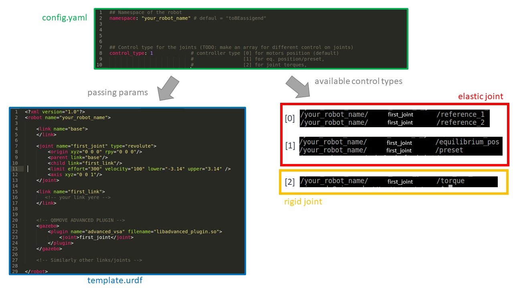

# ROS-Gazebo-plugin-qbmove
ROS-Gazebo plugin for simulate the elastic bheavior of the qbmoves in Gazebo.

# Usage 
Clone the two packages, one implementing the plugin and the other one with two examples, in your current catkin workspace.

There are two ways of using the ROS-Gazebo-plugin-qbmove properly.
-) Standalone, within a simple URDF;
-) Embedded, leveraging on the ROS-qbmove nodes.

For the first solution, the advanced plugin must be inserted into the urdf, associated to each joints of your robot (see the template URDF).

For the second solution the ROS-qbmove package is required. 
In order to add the plugin to the ROS-qbmove, you have to replace the two files insed the folder "qbmove_utils"

# Plugin Overview

